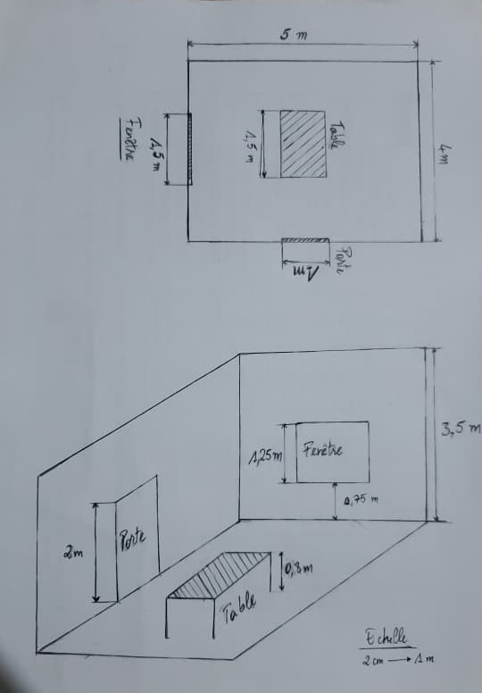

# Exercice - Le Plan de Votre Salle

## Énoncé
Dessinez sur papier la salle que vous construirez tout au long de ce livre. Placez la porte, les fenêtres, une table et ce qui sera posé dessus.

Donnez les dimensions en mètres, pas en unités arbitraires. Une porte fait deux mètres de haut, une table quatre-vingts centimètres. Ces nombres serviront dès le chapitre 7.

## Dimensions

 - Salle : *5 m (Longueur) * 4 m (Largeur) * 3.5 m (hauteur)*
 - Porte : *1.5 m (Longueur) * 1 m (Largeur) * 0.8 m (hauteur)*
 - Porte : *1 m (Largeur) * 2 m (hauteur)*
 - Porte : *1.5 m (Largeur) * 1.25 m (hauteur)*

## Plan
Avec une échelle de *2 cm* pour *1 mètre*

