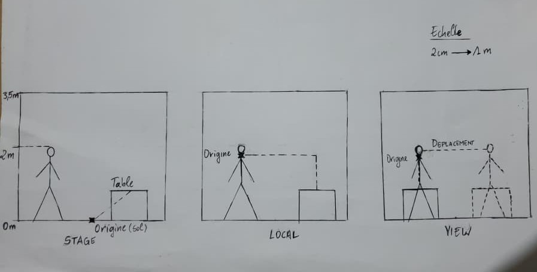

# Exercice - Les Trois Espaces Dessinés

## Énoncé
Sans écrire de code, dessinez sur une même feuille une pièce vue de côté, avec un utilisateur debout, et placez les origines des trois espaces.

Puis placez une table à quatre-vingts centimètres dans chacun des trois, et montrez où elle se retrouve. Rendez le dessin.

## Dessin

