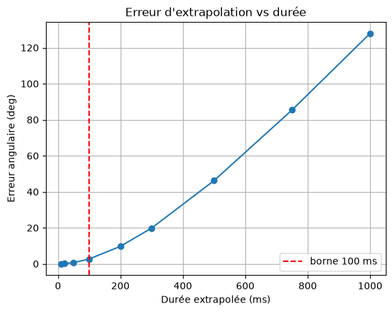

# Exercice - Le Monde à la Mauvaise Echelle

## Énoncé
Extrapolez une pose de tête qui tourne à une vitesse réaliste, disons cent quatre-vingts degrés par seconde, sur des durées croissantes de dix millisecondes à une seconde.

Comparez chaque résultat à la vraie pose, obtenue en simulant le mouvement pas à pas. Rendez la courbe de l'erreur et dites où la borne de cent millisecondes se justifie.

## Résultats
Pour une pose avec une position *(0, 0, 0)*
et du quaternion *(0, 0, 0, 1)* 
nous obtenons :

    dt (ms)   extrapole (deg)   vrai (deg)   erreur (deg)
    10.0000            1.8000       1.7703         0.0297
    20.0000            3.6000       3.4826         0.1174
    50.0000            9.0000       8.2900         0.7100
    100.0000           18.0000      15.3073         2.6927
    200.0000           36.0000      26.2755         9.7245
    300.0000           54.0000      34.1345        19.8655
    500.0000           90.0000      43.8007        46.1993
    750.0000          135.0000      49.5674        85.4326
    1000.0000          180.0000      52.0736       127.9264

## Graphique

Nous observons donc qu'en dessous des 100 millisecondes l'erreur reste en dessous des 3°, mais au dessus elle explose jusqu'à atteindre 127.92°. Voici donc la justification de la borne à 100 millisecondes.

## Code
[la_borne.cpp](./la_borne.cpp)
[graphique.ipynb](./graphique.ipynb)

