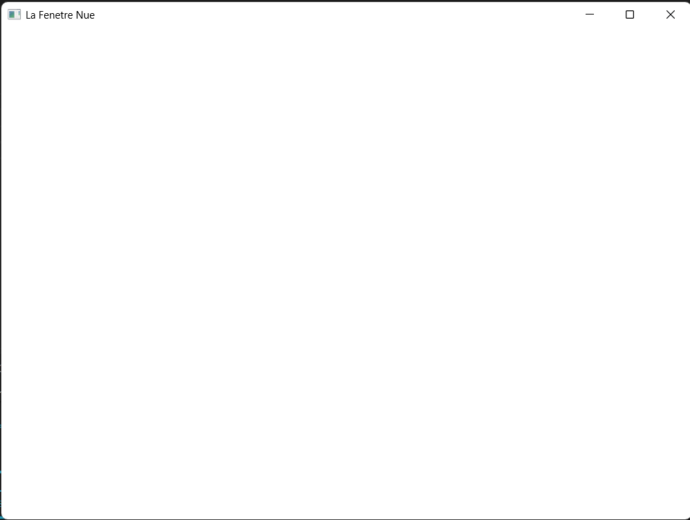

# Exercice - La fenêtre nue

## Enoncé 
Écrivez le programme de quinze lignes de ce chapitre, construisez-le avec Jenga, et lancez-le.

Rendez le fichier `.jenga` et une capture de la fenêtre. Dites combien de temps cela vous a pris, honnêtement : ce nombre vous servira de référence pour mesurer vos progrès.

## Résultats

### Code de main.cpp :

```c++
#include "NKWindow/NKMain.h"
#include "NKWindow/NKWindow.h"

NKENTSEU_DEFINE_APP_DATA(([](){
    nkentseu::NkAppData d{};
    d.appName = "La Fenetre Nue";
    d.appVersion = "0.1.0";
    return d;
})())

int nkmain(const nkentseu::NkEntryState &state)
{
    nkentseu::NkWindowConfig config;
    config.title = "La Fenetre Nue";
    config.width = 1000;
    config.height = 720;

    nkentseu::NkWindow fenetre(config);
    if (!fenetre.IsValid()) {
        return 1;
    }

    while(fenetre.IsOpen()) {
        nkentseu::NkEvents().PollEvents();
    }

    return 0;
}
```

### Capture de la fenêtre :



### fichier .jenga :

[la_fenetre_nue.jenga](./la_fenetre_nue.jenga)

### Temps mis :

Afin de coder cette première fenêtre j'ai mis *5 minutes 34 secondes et 95 tierces*.

## Conclusion
Coder ce court programme qu'est notre première fenetre nous a pris plus de temps que prévu à cause de la découverte de la librairie et de ses contraintes syntaxiques.
