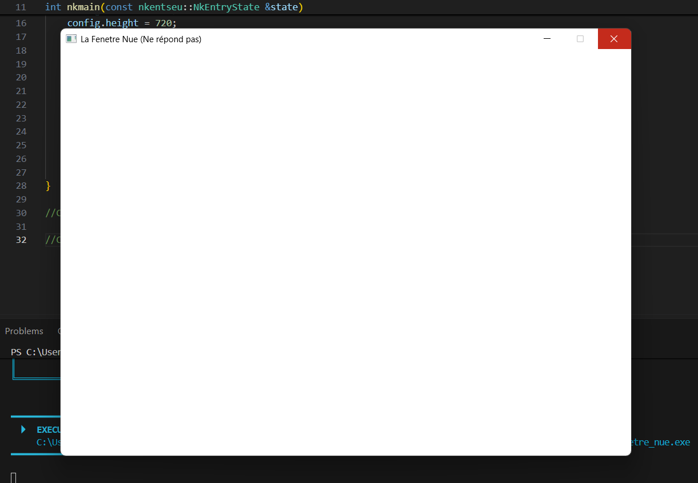

# Exercice - La fenêtre qui ne répond pas

## Enoncé 
Remplacez le corps de la boucle par un commentaire, de façon à ne plus appeler `PollEvents`.

Lancez, attendez, et rendez une capture du moment où le système déclare la fenêtre bloquée. Chronométrez au bout de combien de secondes cela arrive sur votre machine.

## Résultats

### Capture de la fenêtre bloquée : 

### Temps de réalisation

Après avoir exécuté notre programme plusieurs fois, nous avons constaté une variation du temps de réalisation du blocage de la fenêtre. Nous avons donc relevé 10 mesures : 
 - **04.99 secondes**
 - **05.50 secondes**
 - **05.57 secondes**
 - **05.57 secondes**
 - **05.50 secondes**
 - **05.17 secondes**
 - **05.12 secondes**
 - **04.91 secondes**
 - **05.25 secondes**
 - **05.05 secondes**

Nous avons donc : 
 **Moyenne** = 5.26 secondes

 **Etendu** = 0,66 secondes

## Conclusion
Il faut donc environ *5.26 secondes* à ma machine pour bloquer la fenêtre.