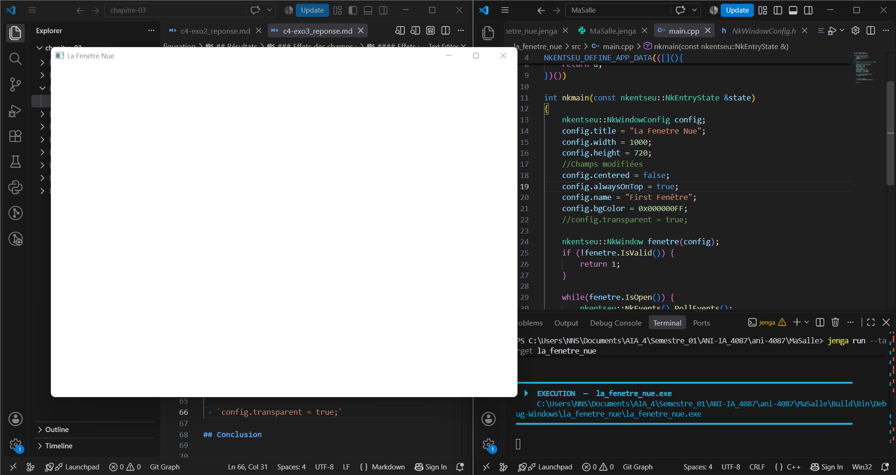
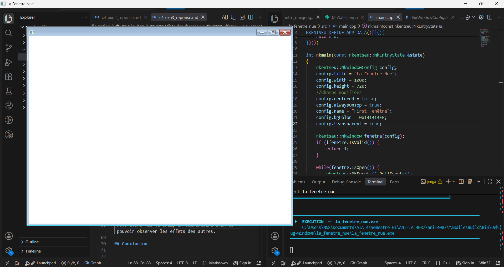

# Exercice - Cinq champs de configuration

## Enoncé 
Modifiez cinq champs de `NkWindowConfig` que le chapitre n'a pas montrés, choisis dans `NkWindowConfig.h`.

Pour chacun, rendez la ligne, ce que vous attendiez, et ce que vous avez observé. Un champ qui n'a rien changé est une réponse valable, à condition de dire pourquoi vous le pensez.

## Résultats

### Extrait du code de NkWindowConfig.h

```c++
    // --- Comportement ---
    bool centered = true;
    bool resizable = true;
    bool movable = true;
    bool closable = true;
    bool minimizable = true;
    bool maximizable = true;
    bool canFullscreen = true;
    bool fullscreen = false;
    bool modal = false;
    bool vsync = true;
    bool dropEnabled = false;
    NkScreenOrientation screenOrientation = NkScreenOrientation::NK_SCREEN_ORIENTATION_AUTO;

    // --- Apparence ---
    bool frame = true;
    bool hasShadow = true;
    bool transparent = false;
    bool visible = true;
    uint32 bgColor = 0x141414FF;
```

### Effets des champs :

#### Extrait de main.cpp

```c++
    nkentseu::NkWindowConfig config;
    config.title = "La Fenetre Nue";
    config.width = 1000;
    config.height = 720;
    //Champs modifiées
    config.centered = false;
    config.alwaysOnTop = true;
    config.name = "First Fenêtre";
    config.bgColor = 0x000000FF;
    config.transparent = true;
```

#### Effets :

 - `config.centered = false;`
 Pour ce champs, comme son nom l'indique il determine la position de base de la fenêtre, si elle sera centrée ou non par rapport à l'écran et comme nous le pensions, en la desactivant cela fonctionne.

 

 Cette image présente belle et bien une fenêtre acentrée, dont le titre est *La Fenêtre Nue* avec un fond blanc.


 - `config.name = "First Fenêtre";`
 Nous pensons que ce champ permet de donner un nom à notre objet fenêtre et comme ce dernier n'est pas le titre de la fenêtre nous ne pouvons pas constater de changement.


 - `config.bgColor = 0x00000FF;`
 Cela semble evident que ce champ permet de changer la couleur de fond de la fenêtre, cependant, en ayant mis `0x000000FF` qui est la couleur noir, nous n'avons observé aucun changement sur la fenêtre.


 - `config.alwaysOnTop = true;`
 En interprétant son nom nous avons déduit qu'il servait à mettre la fenêtre en avant par rapport aux autres. Après l'avoir activé (Mise à True), nous avons favorablement constaté que la fenêtre rester toujours en avant même lorsque le focus passait sur d'autres fenêtres.



 Comme on peut le voir sur cette image, la fenêtre  en focus est celle de VS Code mais la fenêtre en  avant est notre fenêtre.

 
 - `config.transparent = true;`
 Nous pensions qu'il servait à rendre le background de la fenêtre transparent, mais, l'effet observé était bizarre, de base on pourrait penser que rien n'a changé mais en agrandissant la fenetre, une partie de la fenêtre conservait l'arrière plan blanc et tout le reste devenait transparent, et une seconde barre de titre apparaissait à l'emplacement de la fenêtre non agrandie avec les designs des fenêtres de *Windows 7*.



Comme le montre l'image, nous avons notre fenêtre avec une partie au fond blanc et l'autre au fond transparent.


